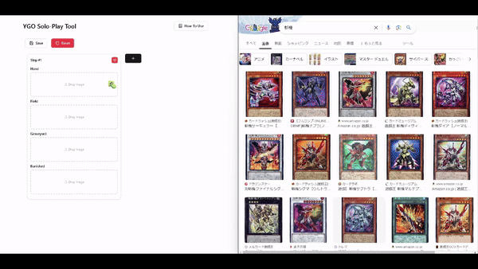

# YGO Solo-Play Tool

A tool that allows you to play Yu-Gi-Oh OCG as solo. It provides you to following functions.

- Create solo-play gameboard.
- Save gameboard you created as `png`.

## Demo



## For users

You can access [this tool](https://ygo-solo-play-tool.vercel.app/) hosted by Vercel.

## For developers

### Env Requirements

- Node.js 20+

### Setup

```bash
$ git clone https://github.com/prs-watch/ygo-solo-play-tool.git
$ cd YOUR_CLONE_PATH
$ npm install
```

### Run dev server

```bash
$ npm run dev
```

### Build static resources

```bash
$ npm run build
```

### Generate TypeDoc

```bash
$ npx typedoc
```